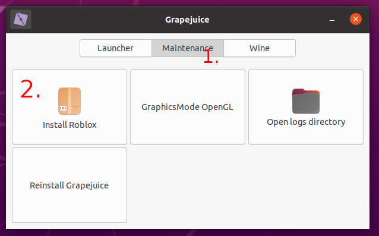
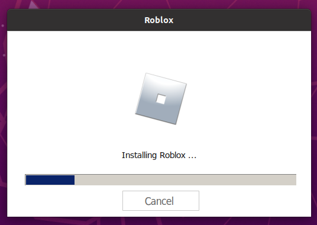

❓ Why does this guide exist?

❗ The complete setup process for Grapejuice is intentionally split up. This makes debugging easier, but can make the
first time set up harder for people who ignore message boxes.

## Start Grapejuice

After you've installed Grapejuice, a shortcut icon should be present in the application launcher of your desktop
environment. Simply search for Grapejuice using its search function or look through the applications list. After
clicking the icon, Grapejuice should open up.

---

⭐ Sometimes the application launcher does not update properly, and Grapejuice won't be present. In that case logging out
and back in again will usually cause Grapejuice to appear.

---

💻 If you do not have an application launcher installed, you can add `$HOME/.local/bin` to your `$PATH` and launch
Grapejuice by running `grapejuice gui` in a terminal session.

## Install Roblox

Installing Roblox is a simple two-step process:

1. Click the tab labeled `Maintenance`
2. Click the button that reads `Install Roblox`

Having installed everything correctly, Roblox should now proceed to install.

## Run Roblox Studio

For the first time, Roblox Studio should be ran by clicking the button in the `Launcher` tab of Grapejuice. Doing this
should cause Roblox Studio to be installed and start.

## Troubleshooting

Are you having issues running Roblox Studio? Please visit the [Troubleshooting page](../Troubleshooting) for more
information.
